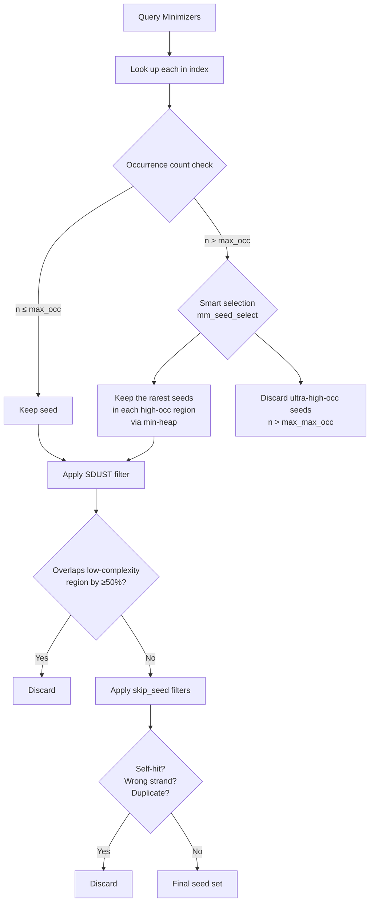

# Minimap2: Minimizer Selection and Chaining Algorithm Guide

This document provides an intuitive, detailed walkthrough of the two core
algorithmic stages in minimap2: **minimizer selection** (sketching) and
**chaining**.  Each section includes diagrams, code references, and highlights
of common pitfalls that can lead to incorrect, spurious, or problematic
alignments.

> **Source references** are given as `file.c:L##` so you can follow along in
> the code.

---

## Table of Contents

1. [High-Level Pipeline Overview](#1-high-level-pipeline-overview)
2. [Minimizer Selection (Sketching)](#2-minimizer-selection-sketching)
   - [What Is a Minimizer?](#21-what-is-a-minimizer)
   - [K-mer Encoding and Hashing](#22-k-mer-encoding-and-hashing)
   - [Sliding Window Selection](#23-sliding-window-selection)
   - [Homopolymer Compression (HPC)](#24-homopolymer-compression-hpc)
   - [Pitfalls in Minimizer Selection](#25-pitfalls-in-minimizer-selection)
3. [Indexing and Seed Lookup](#3-indexing-and-seed-lookup)
   - [Index Structure](#31-index-structure)
   - [Seed Collection and Filtering](#32-seed-collection-and-filtering)
   - [Pitfalls in Seeding](#33-pitfalls-in-seeding)
4. [Chaining](#4-chaining)
   - [What Is Chaining?](#41-what-is-chaining)
   - [Scoring a Link Between Two Seeds](#42-scoring-a-link-between-two-seeds)
   - [Dynamic Programming Chaining](#43-dynamic-programming-chaining-mglchaindp)
   - [RMQ-Optimized Chaining](#44-rmq-optimized-chaining-mglchainrmq)
   - [Backtracking and Chain Extraction](#45-backtracking-and-chain-extraction)
   - [Pitfalls in Chaining](#46-pitfalls-in-chaining)
5. [From Chains to Alignments](#5-from-chains-to-alignments)
6. [Summary of Pitfalls](#6-summary-of-pitfalls)
7. [Glossary](#7-glossary)

---

## 1. High-Level Pipeline Overview

The minimap2 mapping pipeline transforms a raw query sequence into a set of
scored, base-level alignments through the following stages:

```
 ┌──────────────────────────────────────────────────────────────────────────┐
 │                          MINIMAP2 PIPELINE                              │
 │                                                                         │
 │   ┌──────────┐    ┌──────────┐    ┌──────────┐    ┌───────────────┐    │
 │   │ 1. SKETCH│───▶│ 2. SEED  │───▶│ 3. CHAIN │───▶│ 4. ALIGN (SW) │    │
 │   │          │    │          │    │          │    │               │    │
 │   │ Extract  │    │ Look up  │    │ Link     │    │ Extend chains │    │
 │   │ minimiz- │    │ seeds in │    │ seeds    │    │ with Smith-   │    │
 │   │ ers from │    │ index;   │    │ into co- │    │ Waterman to   │    │
 │   │ query &  │    │ filter   │    │ linear   │    │ produce base- │    │
 │   │ reference│    │ repeats  │    │ chains   │    │ level CIGAR   │    │
 │   └──────────┘    └──────────┘    └──────────┘    └───────────────┘    │
 │                                                                         │
 │   sketch.c         seed.c          lchain.c         align.c             │
 │                     map.c           map.c            ksw2_*.c           │
 └──────────────────────────────────────────────────────────────────────────┘
```

This document focuses on **stages 1–3**.

---

## 2. Minimizer Selection (Sketching)

**Source:** `sketch.c`

### 2.1 What Is a Minimizer?

A *minimizer* is a representative k-mer chosen from a sliding window of *w*
consecutive k-mers.  Within each window, the k-mer with the **smallest hash
value** is selected.  Because adjacent windows overlap, consecutive windows
often share the same minimizer, which dramatically reduces the number of seeds
while preserving sensitivity.

```
  Sequence:    A  C  G  T  A  A  G  G  C  T  A  C  G  ...
               ├────────── k=4 ──────────┤
                  ├────────── k=4 ──────────┤
                     ├────────── k=4 ──────────┤
                        ...

  K-mers:      ACGT  CGTA  GTAA  TAAG  AAGG  AGGC  GGCT  GCTA  CTAC  TACG
  Hashes:       42    87    15    63    29    71     8    55    38    91

  Window w=4:  ╠═══════════════╣                                        Window 1
                    ╠═══════════════╣                                   Window 2
                         ╠═══════════════╣                              Window 3
                              ╠═══════════════╣                         Window 4
                                   ╠═══════════════╣                    Window 5
                                        ╠═══════════════╣               Window 6
                                             ╠═══════════════╣          Window 7

  Selected:          ★              ★                ★
  minimizer     (hash=15)      (hash=29)         (hash=8)
```

**Key insight:** Instead of indexing *every* k-mer (which is expensive), we
index only minimizers.  If two sequences share a region longer than `w + k − 1`
bases, they are *guaranteed* to share at least one minimizer in that region.
This makes the approach both fast and sensitive.

### 2.2 K-mer Encoding and Hashing

**Source:** `sketch.c:L28–38` (hash function), `sketch.c:L106–113` (k-mer encoding)

Each base is encoded in 2 bits (A=0, C=1, G=2, T=3).  Both the **forward** and
**reverse complement** k-mers are tracked simultaneously as the window slides:

```
  Forward k-mer:   kmer[0] = (kmer[0] << 2 | base) & mask
  RevComp k-mer:   kmer[1] = (kmer[1] >> 2) | (complement << shift)
```

The **canonical k-mer** is whichever is lexicographically smaller.  This ensures
that the same genomic region produces the same minimizer regardless of which
strand is read:

```
  Forward:   5'─ A C G T ─3'    kmer[0] = 0b00011011
  RevComp:   3'─ T G C A ─5'    kmer[1] = 0b11100100

  Canonical = min(kmer[0], kmer[1])  →  kmer[0]
  Strand    = 0 (forward was smaller)
```

The canonical k-mer is then passed through a **hash function** (`hash64`) that
uses a mix of bit-shifts, XORs, and multiplications to distribute values
uniformly.  This prevents naturally biased sequences (e.g., AT-rich regions)
from clustering:

```
  hash64(canonical_kmer, mask) → 56-bit hash value
```

**Palindromic (self-complementary) k-mers are skipped** because their strand is
ambiguous (`sketch.c:L108`).

### 2.3 Sliding Window Selection

**Source:** `sketch.c:L117–138`

The algorithm maintains a circular buffer of size *w* that stores the hash of
each k-mer.  As each new k-mer enters the window:

```
  ┌──────────────────────────────────────────────────────────┐
  │  SLIDING WINDOW MINIMIZER SELECTION                      │
  │                                                          │
  │  Circular buffer (size w):                               │
  │  ┌─────┬─────┬─────┬─────┐                              │
  │  │ h₀  │ h₁  │ h₂  │ h₃  │   (w=4 shown)              │
  │  └─────┴─────┴─────┴─────┘                              │
  │            ▲                                             │
  │         buf_pos                                          │
  │                                                          │
  │  Step 1: Store new hash at buf[buf_pos]                  │
  │                                                          │
  │  Step 2: Compare new hash to current minimum:            │
  │                                                          │
  │  CASE A: new_hash ≤ current_min                          │
  │    → Output old minimum (if valid)                       │
  │    → New hash becomes new minimum                        │
  │                                                          │
  │  CASE B: current_min has slid out of window              │
  │    → Output old minimum                                  │
  │    → Rescan entire buffer for new minimum                │
  │                                                          │
  │  CASE C: new_hash > current_min and min still in window  │
  │    → Do nothing; current minimum persists                │
  │                                                          │
  │  Step 3: Advance buf_pos = (buf_pos + 1) % w            │
  └──────────────────────────────────────────────────────────┘
```

**Tie-breaking:** When two k-mers have the same hash, the algorithm prefers the
**rightmost** (most recent) one when inserting (`≤`), and when rescanning after
the minimum leaves the window it prefers the rightmost via `≥` comparisons.
This is a subtle but important design choice that affects which minimizers are
output and their density.

**Output encoding** (`sketch.c:L113`):

Each minimizer is stored as an `mm128_t` (128-bit tuple):

```
  ┌──────────── x (64 bits) ────────────┐  ┌──────────── y (64 bits) ────────────┐
  │ hash_value (56 bits) │ kmer_span (8) │  │ ref_id (32 bits) │ position (31) │s│
  └──────────────────────┴───────────────┘  └──────────────────┴────────────────┴─┘
                                                                          strand bit
```

### 2.4 Homopolymer Compression (HPC)

**Source:** `sketch.c:L94–105`

Homopolymer runs (e.g., `AAAA`) are common sequencing errors.  When HPC mode is
enabled (`-H`), consecutive identical bases are collapsed into a single
representative:

```
  Original:    A  C  G  G  G  G  T  A  A  C
  After HPC:   A  C  G           T  A     C

  K-mers are computed on the COMPRESSED sequence,
  but positions refer to the ORIGINAL sequence.
```

The **kmer_span** field in the output records the physical span of the k-mer in
the original (uncompressed) sequence.  For example, a k-mer spanning compressed
positions 0–3 might span physical positions 0–8 if it includes a long
homopolymer.

A small internal queue (`tq`) tracks the length of each homopolymer run within
the current k-mer window.

### 2.5 Pitfalls in Minimizer Selection

> ⚠️ **Pitfall 1 — Low-complexity regions produce minimizer clusters.**
> Regions like `ATATAT...` generate many k-mers with similar or identical
> hashes, causing a flood of seed hits. Minimap2 mitigates this with **SDUST**
> masking (`sdust.c`), which identifies and suppresses minimizers that overlap
> low-complexity regions by ≥50%.
>
> **Impact:** Without masking, these regions produce massive numbers of spurious
> seed matches that dramatically slow chaining and can produce false alignments.

> ⚠️ **Pitfall 2 — Palindromic k-mers are silently discarded.**
> K-mers whose forward and reverse complement are identical (e.g., `ACGT` for
> k=4) are skipped (`sketch.c:L108`).  For very small *k*, a non-trivial
> fraction of k-mers may be palindromic, reducing sensitivity.
>
> **Impact:** Rare in practice for k≥15, but important to keep in mind for
> custom short-k applications.

> ⚠️ **Pitfall 3 — Window size *w* trades sensitivity for speed.**
> Larger *w* reduces the number of minimizers (faster, less memory), but
> increases the chance that a short matching region contains no shared minimizer
> (lower sensitivity).  The guarantee holds only for matches of length ≥ `w + k − 1`.
>
> **Impact:** Choosing too large a *w* can cause short true matches to be
> missed entirely.  Presets are tuned to balance this.

> ⚠️ **Pitfall 4 — HPC can merge distinct genomic positions.**
> Homopolymer compression improves alignment through homopolymer errors, but
> two distinct genomic regions that differ only in homopolymer length will
> produce the *same* minimizers after compression, potentially creating false
> seed matches.
>
> **Impact:** Can cause mis-mapping in genomes with many homopolymer length
> polymorphisms.

---

## 3. Indexing and Seed Lookup

### 3.1 Index Structure

**Source:** `index.c:L93–110`

Reference minimizers are stored in a **hash table** partitioned into 2^*b*
buckets.  Each minimizer's low-order *b* bits determine its bucket, and its
high-order bits serve as the key within that bucket:

```
  Minimizer hash: ───────────────────────────────────────
                  │          key (high bits)     │bucket│
                  ───────────────────────────────────────
                                                  b bits

  ┌─────────────────────── mm_idx_t ───────────────────────┐
  │                                                        │
  │   B[0]     B[1]     B[2]    ...   B[2^b - 1]          │
  │   ┌────┐   ┌────┐   ┌────┐       ┌────┐               │
  │   │hash│   │hash│   │hash│       │hash│   ← per-bucket │
  │   │tbl │   │tbl │   │tbl │       │tbl │     hash table │
  │   └──┬─┘   └──┬─┘   └──┬─┘       └──┬─┘               │
  │      │        │        │             │                  │
  │      ▼        ▼        ▼             ▼                  │
  │   ┌──────┐ ┌──────┐ ┌──────┐     ┌──────┐             │
  │   │pos[] │ │pos[] │ │pos[] │     │pos[] │ ← position  │
  │   │array │ │array │ │array │     │array │   arrays     │
  │   └──────┘ └──────┘ └──────┘     └──────┘             │
  └────────────────────────────────────────────────────────┘

  Each entry in the hash table either:
    • Points to a single position      (rare minimizers)
    • Points into the position array    (repeated minimizers)
```

**Query** (`mm_idx_get`, `index.c:L93`): Given a minimizer hash, the function
selects the bucket, looks up the key, and returns an array of reference
positions where that minimizer occurs, along with a count.

### 3.2 Seed Collection and Filtering

**Source:** `seed.c`, `map.c:L78–204`

After looking up each query minimizer in the index, minimap2 applies several
filters to keep only informative seeds:



#### Smart Seed Selection (`seed.c:L56–96`)

In repetitive regions, instead of discarding *all* high-occurrence seeds, the
algorithm keeps a limited number by selecting those with the **lowest occurrence
counts** (the "rarest" within the repetitive region):

```
  Query:       ═══════════════════════════════════════
  Seeds:       │ │ │ │ │ │ │ │ │ │ │ │ │ │ │ │ │ │ │

               low-occ     HIGH-OCC REGION       low-occ
  Occurrences: 3  5  2   150 200 180 120 90 170   4  3  7

  Strategy:  Keep ALL     Keep the RAREST seeds   Keep ALL
                          up to max_high_occ
                          (e.g., keep 120 and 90)

  This preserves SOME anchors in repetitive regions
  while preventing a combinatorial explosion of hits.
```

A **min-heap** on occurrence count is used to efficiently keep the top-*N*
rarest seeds from the high-occurrence stretch (`seed.c:L77–85`).

#### Tandem Repeat Detection

When two adjacent minimizers share the same k-mer sequence, the seed is flagged
as `is_tandem` (`seed.c:L47–48`).  Tandem seeds receive special treatment
during chaining to prevent artificially inflated chain scores.

### 3.3 Pitfalls in Seeding

> ⚠️ **Pitfall 5 — High-occurrence threshold too low discards true matches.**
> If `max_occ` is set too low, seeds in segmental duplications or gene families
> are aggressively filtered, potentially causing missed alignments in these
> biologically important regions.
>
> **Impact:** Reads from duplicated regions may fail to align or align only
> partially.

> ⚠️ **Pitfall 6 — Tandem repeats inflate seed counts.**
> A short tandem repeat (e.g., `CAGCAGCAG...`) can produce many seeds that
> match the same or similar reference positions.  Without the tandem flag and
> special handling in chaining, these would create artificially high chain scores
> and potentially dominate over the true alignment.
>
> **Impact:** Can cause spurious high-scoring chains in repeat regions.

> ⚠️ **Pitfall 7 — Asymmetric filtering in all-vs-all mode.**
> The `skip_seed()` function (`map.c:L78–100`) applies asymmetric filtering for
> all-vs-all overlap detection (`-X` flag): only one direction of each
> query/target pair is kept.  If this logic is misconfigured, overlaps can be
> either duplicated or lost entirely.

---

## 4. Chaining

**Source:** `lchain.c`

### 4.1 What Is Chaining?

After seeding, we have a set of **anchor points** — positions where the query
and reference share a k-mer.  Chaining connects these anchors into **collinear
chains** that represent candidate alignments.

The key idea: in a true alignment, anchors should appear in the same order on
both the query and reference, and they should lie roughly along a **diagonal**:

```
  Reference position →
  ┌────────────────────────────────────────────┐
  │                                        ●   │
  │                                     ●      │
  │                                  ●         │
  │                              ●             │  ← True alignment:
  │                           ●                │    seeds on a diagonal
  │                       ●                    │
  │                    ●                       │
  │                ●                           │
  │             ●                              │
  │         ●                                  │
  │      ●                                     │
  │   ●                                        │
  └────────────────────────────────────────────┘
  ↑
  Query position
```

A **gap** between consecutive anchors in a chain means the alignment has an
insertion, deletion, or unmatched region.  The chaining algorithm scores chains
by balancing the number of matching anchors against penalty for gaps.

### 4.2 Scoring a Link Between Two Seeds

**Source:** `lchain.c:L113–138` (`comput_sc`)

For two seeds *j* → *i* (where *i* comes after *j*), the score of linking
them is:

```
  Given seeds j and i:
    dq = query_pos(i) - query_pos(j)      ← distance on query
    dr = ref_pos(i) - ref_pos(j)          ← distance on reference
    dd = |dr - dq|                         ← diagonal deviation (gap size)
    dg = min(dr, dq)                       ← inner distance

  ┌─────────────────────────────────────────────────────────────────┐
  │         Reference                                               │
  │    ├─────── dr ───────┤                                         │
  │    j●─ ─ ─ ─ ─ ─ ─ ─ ─ ┐                                      │
  │    │                     │ dd ← gap (off-diagonal)              │
  │    │  dq                 │                                      │
  │    │                   ●i                                       │
  │    Query                                                        │
  │                                                                 │
  │  Perfect collinear (no gap):  dr = dq,  dd = 0                 │
  │  Insertion in query:          dr < dq,  dd = dq - dr           │
  │  Deletion in query:           dr > dq,  dd = dr - dq           │
  └─────────────────────────────────────────────────────────────────┘

  Score = min(seed_span, dg)                      ← match bonus
        − chn_pen_gap × dd                        ← linear gap penalty
        − chn_pen_skip × dg                       ← distance penalty
        − 0.5 × log₂(dd + 1)                     ← concave (log) gap penalty
```

**Validity checks** — a link is rejected (`INT32_MIN`) if:
- Seeds are on different reference sequences (different `tid`)
- Distance exceeds `max_dist_x` or `max_dist_y`
- Diagonal deviation exceeds the **bandwidth** (`bw`)
- Query distance is negative or zero (wrong order)

The **concave gap penalty** (logarithmic term) is crucial: it penalizes the
*first* base of a gap heavily but becomes progressively lenient for longer gaps.
This models biological reality, where a single long indel is more likely than
many short ones totaling the same length.

### 4.3 Dynamic Programming Chaining (`mg_lchain_dp`)

**Source:** `lchain.c:L148–217`

This is the core chaining algorithm.  Seeds are sorted by reference position,
and for each seed *i*, the algorithm looks backward to find the best preceding
seed *j* to chain with:

```
  ┌───────────────────────────────────────────────────────────────────┐
  │  CHAINING DP                                                      │
  │                                                                   │
  │  Seeds (sorted by reference position):                            │
  │                                                                   │
  │  Index:    0     1     2     3     4     5     6     7     8      │
  │  Score:   [5]   [3]   [8]   [7]   [12]  [4]   [15]  [11]  [18]  │
  │                                                                   │
  │  For seed i=8:                                                    │
  │    Try j=7:  score(7→8) = f[7] + link_score(7,8) = ?             │
  │    Try j=6:  score(6→8) = f[6] + link_score(6,8) = ?             │
  │    Try j=5:  score(5→8) = f[5] + link_score(5,8) = ?             │
  │    ...                                                            │
  │    ╠═══════╗                                                      │
  │    ║ st    ║  ← stop looking beyond max_dist or max_iter          │
  │    ╚═══════╝                                                      │
  │                                                                   │
  │  f[8] = max over all valid j of { f[j] + link_score(j, 8) }     │
  │  p[8] = argmax j  (backpointer to best predecessor)              │
  └───────────────────────────────────────────────────────────────────┘
```

**The DP recurrence:**

```
  f[i] = max( seed_score(i),                           ← start new chain
              max over j<i { f[j] + comput_sc(j, i) }  ← extend existing chain
            )
  p[i] = j that achieves the maximum (or −1 if starting new chain)
```

**Optimization: Early termination** (`max_skip`, `max_iter`):

The naive O(n²) algorithm looks at all previous seeds for each seed *i*.  Two
heuristics reduce the work:

1. **`max_iter`** — Only look at the most recent `max_iter` seeds (by reference
   position).  Seeds further back are ignored.

2. **`max_skip`** — If `max_skip` consecutive seeds fail to improve the best
   score, stop looking further back.  The intuition is that if we've already
   found a good predecessor and many recent seeds don't improve it, earlier
   seeds are even less likely to help.

```
  ┌─────────────────────────────────────────────────────┐
  │  EARLY TERMINATION (max_skip = 3 example)           │
  │                                                     │
  │  Seed i is trying predecessors j = i-1, i-2, ...   │
  │                                                     │
  │  j=i-1:  score=45  ← best so far!    skip_count=0  │
  │  j=i-2:  score=42  ← not better      skip_count=1  │
  │  j=i-3:  score=38  ← not better      skip_count=2  │
  │  j=i-4:  score=41  ← not better      skip_count=3  │
  │                                                     │
  │  skip_count == max_skip → STOP LOOKING              │
  │                                                     │
  │  This can miss the globally optimal chain, but is   │
  │  extremely effective in practice.                   │
  └─────────────────────────────────────────────────────┘
```

**Fallback mechanism** (`lchain.c:L189–200`): To prevent `max_skip` from being
too aggressive, the algorithm also tracks the globally best-scoring seed
`max_ii` in range. If the backward search didn't find a good predecessor, it
falls back to connecting to this global best.

### 4.4 RMQ-Optimized Chaining (`mg_lchain_rmq`)

**Source:** `lchain.c:L250–368`

For large seed sets, the O(n²) DP becomes expensive.  The RMQ (Range Maximum
Query) variant uses a balanced search tree to achieve **O(n log n)** performance:

```
  ┌─────────────────────────────────────────────────────────────────┐
  │  RMQ CHAINING vs DP CHAINING                                    │
  │                                                                 │
  │  DP Chaining:                                                   │
  │    For each seed i: scan ALL seeds j in [st, i-1]              │
  │    → O(n × max_iter) per seed                                  │
  │                                                                 │
  │  RMQ Chaining:                                                  │
  │    Maintains a balanced tree of seeds, keyed by query position  │
  │    For each seed i: query tree for best seed in range           │
  │      [q_pos(i) - max_dist, q_pos(i)]                           │
  │    → O(log n) per query                                        │
  │                                                                 │
  │    ┌─ Balanced Tree (KRMQ) ─┐                                  │
  │    │                         │                                  │
  │    │   Query seeds in the    │                                  │
  │    │   current ref-position  │                                  │
  │    │   window, organized by  │                                  │
  │    │   query position with   │                                  │
  │    │   priority = f[j] +     │                                  │
  │    │   position_weight       │                                  │
  │    │                         │                                  │
  │    └─────────────────────────┘                                  │
  │                                                                 │
  │  Window Management:                                             │
  │    As ref position advances, insert new seeds and remove those  │
  │    that fall outside the max_dist window.                       │
  └─────────────────────────────────────────────────────────────────┘
```

**Priority metric** (`lchain.c:L285`):

```
  priority(j) = −( f[j] + 0.5 × chn_pen_gap × (ref_pos(j) + query_pos(j)) )
```

This clever composite metric combines the chain score with a position weight,
ensuring that among seeds with similar scores, those closer to the diagonal are
preferred.  The negative sign makes it work as a minimum in the tree (the "best"
seed has the most negative priority).

**Two-level search:**

The RMQ chaining uses two trees — an **outer** tree for coarse range queries
(`max_dist`) and an optional **inner** tree for stricter queries
(`max_dist_inner`).  The inner tree provides more precise results when the outer
query returns a suboptimal candidate:

```
  ┌─────── Query Seed i ────────┐
  │                              │
  │  Outer range: [qpos - max_dist, qpos]          → fast, approximate
  │  Inner range: [qpos - max_dist_inner, qpos]    → slow, precise
  │                              │
  │  If outer result ≠ exact predecessor:           │
  │    Search inner tree exhaustively               │
  │    Apply full comput_sc() scoring               │
  └──────────────────────────────┘
```

### 4.5 Backtracking and Chain Extraction

**Source:** `lchain.c:L27–76` (`mg_chain_backtrack`)

After the DP fills the score array `f[]` and backpointer array `p[]`, chains
are extracted by following backpointers from high-scoring seeds:

```
  ┌────────────────────────────────────────────────────────────────┐
  │  CHAIN BACKTRACKING                                            │
  │                                                                │
  │  Seeds:  0    1    2    3    4    5    6    7    8    9         │
  │  f[]:   [5]  [8]  [14] [12] [22] [18] [28] [25] [35] [15]    │
  │  p[]:   [-1] [0]  [1]  [1]  [2]  [3]  [4]  [4]  [6]  [5]    │
  │                                                                │
  │  Step 1: Sort seeds by score, descending:                      │
  │          i=8(35), i=6(28), i=7(25), i=4(22), ...              │
  │                                                                │
  │  Step 2: Trace back from i=8:                                  │
  │          8 → p[8]=6 → p[6]=4 → p[4]=2 → p[2]=1 → p[1]=0     │
  │          Chain: [0, 1, 2, 4, 6, 8]  score=35  count=6         │
  │          Mark all as visited.                                  │
  │                                                                │
  │  Step 3: Next unvisited: i=7                                   │
  │          7 → p[7]=4 → already visited! Stop.                   │
  │          Chain: [7]  (doesn't meet min_cnt, discard)           │
  │                                                                │
  │  Step 4: Continue until all high-scoring seeds processed.      │
  └────────────────────────────────────────────────────────────────┘
```

**`max_drop` tolerance** (`lchain.c:L9–25`, `mg_chain_bk_end`):

During backtracking, the algorithm allows the score to **dip** below the peak
by up to `max_drop` before declaring the chain boundary.  This handles cases
where a chain passes through a low-quality region:

```
  Score along chain:
        ╱╲
       ╱  ╲        ╱╲
      ╱    ╲      ╱  ╲          ╱╲
     ╱      ╲    ╱    ╲        ╱  ╲
    ╱        ╲  ╱      ╲      ╱    ╲
   ╱          ╲╱        ╲    ╱      ╲
  ╱                      ╲  ╱        ╲
                          ╲╱
  ◀────── chain ──────────▶
                           ▲
                    This dip is OK if
                    (peak - dip) < max_drop.
                    The chain continues.
```

**Output format:** Each chain is stored as:

```
  u[i] = chain_score (upper 32 bits) | seed_count (lower 32 bits)
```

Chains are then sorted by reference position for downstream processing.

### 4.6 Pitfalls in Chaining

> ⚠️ **Pitfall 8 — `max_skip` can cause suboptimal chains.**
> The early termination heuristic (`max_skip`) can miss the true best
> predecessor if it is separated from seed *i* by many intervening seeds that
> happen to score lower.  This is the classic speed-vs-accuracy trade-off.
>
> **Impact:** A true collinear chain might be broken into two shorter chains,
> reducing the alignment score and potentially causing the alignment to be
> filtered as secondary.

> ⚠️ **Pitfall 9 — Bandwidth (`bw`) rejects valid chains with large indels.**
> The bandwidth parameter limits the diagonal deviation (`dd`) between linked
> seeds.  If a true alignment contains a large insertion or deletion, seeds on
> either side will have a large `dd` and the link will be rejected.
>
> **Impact:** Alignments spanning structural variants (large indels) may be
> split into separate chains or missed entirely.  The concave gap penalty
> partially addresses this by being lenient on long gaps, but `bw` imposes a
> hard upper limit.

> ⚠️ **Pitfall 10 — `max_iter` limits sensitivity in dense seed regions.**
> In regions with very dense seed matches (e.g., highly similar sequences), the
> `max_iter` cap may prevent the algorithm from reaching the true best
> predecessor.
>
> **Impact:** Can affect accuracy in regions with very high similarity or near
> segmental duplications where many seeds cluster together.

> ⚠️ **Pitfall 11 — Tandem duplications can create false high-scoring chains.**
> If a query maps to a region with tandem duplications, seeds from different
> copies can be chained together, creating a chimeric chain that does not
> correspond to a single true alignment.
>
> **Impact:** May produce incorrect mapping coordinates, especially in genomes
> rich in tandem repeats.  The `is_tandem` flag helps mitigate this.

> ⚠️ **Pitfall 12 — RMQ chaining may produce slightly different results from DP.**
> The RMQ algorithm uses a composite priority metric that approximates the DP
> scoring.  In rare cases, it may select a different predecessor than the exact
> DP would, leading to slightly different chain scores.
>
> **Impact:** Usually negligible, but can affect borderline cases where two
> chains have similar scores.

> ⚠️ **Pitfall 13 — `max_drop` can produce overly long chains through noise.**
> If `max_drop` is too generous, a chain may extend through a region of
> spurious anchors (e.g., a repeat that happens to be collinear), producing an
> artificially long chain that spans a non-homologous region.
>
> **Impact:** Can cause false alignments, especially in repetitive genomes.

---

## 5. From Chains to Alignments

After chaining, each chain is a candidate alignment defined by its anchor seeds.
The final stages convert these into base-level alignments:

```
  ┌────────────────────────────────────────────────────────────────────────┐
  │  CHAIN TO ALIGNMENT PIPELINE                                          │
  │                                                                       │
  │  ┌──────────────┐     ┌──────────────────┐     ┌──────────────────┐  │
  │  │ Chain seeds   │────▶│ Coordinate       │────▶│ Smith-Waterman   │  │
  │  │ (anchors)     │     │ Resolution       │     │ Extension        │  │
  │  │               │     │ (hit.c)          │     │ (align.c)        │  │
  │  │ ●──●──●──●    │     │ Set rs,re,qs,qe  │     │ Fill gaps with   │  │
  │  │               │     │ from first/last   │     │ base-level DP    │  │
  │  │               │     │ seed coordinates  │     │ → CIGAR string   │  │
  │  └──────────────┘     └──────────────────┘     └───────┬──────────┘  │
  │                                                        │              │
  │                                                        ▼              │
  │  ┌──────────────────┐     ┌──────────────────┐  ┌──────────────────┐ │
  │  │ Output           │◀────│ Filtering &      │◀─│ Secondary        │ │
  │  │ (PAF/SAM)        │     │ Mapping Quality  │  │ Assignment       │ │
  │  │                  │     │                  │  │ (hit.c)          │ │
  │  │ format.c         │     │ Min score, mapQ  │  │ Overlap-based    │ │
  │  │                  │     │ zdrop filter     │  │ parent/child     │ │
  │  └──────────────────┘     └──────────────────┘  └──────────────────┘ │
  └────────────────────────────────────────────────────────────────────────┘
```

Between seeds, **Smith-Waterman** dynamic programming (`ksw2` library) fills in
the base-level alignment.  The algorithm uses **SSE/NEON SIMD** vectorization
for performance and supports:

- **Affine gap penalties** (standard two-piece: open + extend)
- **Dual affine gaps** (separate penalties for short and long gaps)
- **Spliced alignment** (RNA-seq with intron penalties)

**Z-drop filtering** (`align.c`): If the alignment score drops by more than
`zdrop` from its peak during extension, the extension is terminated.  This
prevents runaway alignments into non-homologous sequence.

**Secondary alignment assignment** (`hit.c:L125–186`): Overlapping chains are
classified as primary or secondary based on query coverage overlap.  If chain
*i* overlaps chain *j* by more than `mask_level` of the shorter chain's length,
the lower-scoring chain becomes a secondary alignment of the higher-scoring one.

---

## 6. Summary of Pitfalls

| # | Stage | Pitfall | Symptom | Mitigation |
|---|-------|---------|---------|------------|
| 1 | Sketch | Low-complexity minimizer clusters | Slow chaining, false hits | SDUST masking |
| 2 | Sketch | Palindromic k-mers discarded | Reduced sensitivity (rare for k≥15) | Use sufficiently large k |
| 3 | Sketch | Window size too large | Missed short matches | Appropriate preset selection |
| 4 | Sketch | HPC merges distinct regions | False seed matches at homopolymers | Disable HPC if necessary |
| 5 | Seed | max_occ too low | Missed alignments in duplicated regions | Tune occurrence thresholds |
| 6 | Seed | Tandem repeats inflate counts | Spurious high-scoring chains | Tandem detection flags |
| 7 | Seed | Asymmetric all-vs-all filtering | Lost or duplicated overlaps | Correct flag usage |
| 8 | Chain | max_skip suboptimality | Broken chains, weaker scores | Increase max_skip (slower) |
| 9 | Chain | Bandwidth rejects large indels | Split chains at structural variants | Increase bw parameter |
| 10 | Chain | max_iter in dense regions | Missed optimal predecessors | Increase max_iter (slower) |
| 11 | Chain | Tandem duplications create chimeric chains | Incorrect coordinates | Tandem-aware scoring |
| 12 | Chain | RMQ approximation | Slightly different results from DP | Typically negligible |
| 13 | Chain | max_drop too generous | Chains through spurious anchors | Conservative max_drop |

---

## 7. Glossary

| Term | Definition |
|------|-----------|
| **k-mer** | A subsequence of length *k* from a nucleotide sequence |
| **Minimizer** | The k-mer with the smallest hash value within a sliding window of *w* consecutive k-mers |
| **Sketch** | The set of all minimizers extracted from a sequence |
| **Seed / Anchor** | A position pair (query, reference) where the same minimizer occurs in both sequences |
| **Chain** | An ordered set of collinear seeds that together represent a candidate alignment |
| **Diagonal** | In a (query_pos, ref_pos) coordinate system, seeds from a gapless alignment lie on a line of slope 1; the intercept is the "diagonal" |
| **Bandwidth (bw)** | Maximum allowed deviation from the diagonal between consecutive seeds in a chain |
| **HPC** | Homopolymer compression: collapsing consecutive identical bases into one representative |
| **SDUST** | A low-complexity masking algorithm that identifies and suppresses simple repeats |
| **Concave gap penalty** | A gap cost function where the per-base penalty *decreases* as the gap grows (typically logarithmic), modeling the biological observation that a single long indel is more likely than many short ones |
| **Z-drop** | A score-drop threshold: if the alignment score drops by more than this value from its peak, extension is terminated |
| **RMQ** | Range Maximum Query: a data structure that efficiently finds the maximum (or minimum) value in a subrange of an array |
| **Smith-Waterman** | A dynamic programming algorithm for local sequence alignment |
| **CIGAR** | Compact Idiosyncratic Gapped Alignment Report: a string encoding the alignment operations (match, insertion, deletion, etc.) |
| **PAF** | Pairwise Alignment Format: a TAB-delimited text format for sequence alignments |
| **Canonical k-mer** | The lexicographically smaller of a k-mer and its reverse complement; ensures consistent representation regardless of strand |
